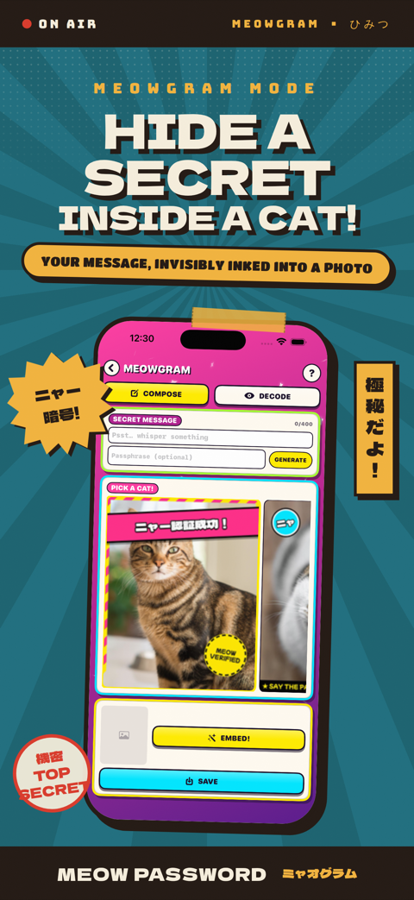

# MeowPassword

A command-line utility that generates secure, phrase-based passwords using cat names and Kolmogorov complexity analysis with a lolcat theme.

<p align="center">
  
</p>

<p align="center"><em>MeowGram: hide a secret message inside an ordinary-looking cat photo, then decode it on the other end.</em></p>

## Features

- **1000+ Embedded Cat Names** - No external file dependencies
- **Secure Password Generation** - Creates passwords from 3-5 cat names with configurable length (15-50 characters)
- **Advanced Security Transformations**:
  - 3 letters randomly capitalized
  - Configurable numbers inserted randomly (1-10, default: 3-5)
  - Configurable symbols replacing letters (1-10, default: 2)
  - Removes repeating letters with random digits
- **Kolmogorov Complexity Analysis** - Evaluates and selects the most secure password from 5 candidates
- **Lolcat Theme** - ASCII art and professional interface without emojis
- **Configurable Parameters** - Control numbers, symbols, and maximum length
- **Clipboard Support** - Copy to clipboard (macOS only)
- **Apple Keychain Integration** - Save passwords directly to macOS Keychain / iCloud Keychain (macOS only)
- **Self-Contained Executable** - Single binary with embedded data
- **MeowStego – Cat-Image Passkeys** - Embed authentication payloads invisibly in cat images using DCT steganography (a fun, branded alternative to QR codes)

## Quick Start

### Install with Homebrew (Recommended)
```bash
# Tap the repository
brew tap SpaceTrucker2196/meowpassword https://github.com/SpaceTrucker2196/MeowPassword.git

# Install MeowPassword
brew install meowpass

# Now use from anywhere!
meowpass
```

### Build with Swift Package Manager
```bash
# Clone the repository
git clone https://github.com/SpaceTrucker2196/MeowPassword.git
cd MeowPassword

# Build using Swift Package Manager
swift build -c release

# Run the executable
.build/release/meowpass
```

### Build and Install (Manual)
```bash
# Clone the repository
git clone https://github.com/SpaceTrucker2196/MeowPassword.git
cd MeowPassword

# Build and install as system command
./build_production.sh
./install.sh

# Now use from anywhere!
meowpass
```

### Alternative Build (using build.sh)
```bash
# Build using alternative script
./build.sh

# Use locally
./meowpass
```

## Usage

### Generate Password
```bash
meowpass
```

### Generate with Custom Parameters
```bash
meowpass --numbers 4 --symbols 3 --max-length 30
```

### Run Tests
```bash
meowpass --test
```

### Copy to Clipboard (macOS)
```bash
meowpass --copy
```

### Save to Apple Keychain (macOS)
```bash
meowpass --save-to-keychain
meowpass --save-to-keychain --service com.example.myapp --account alice
```

### Embed a Payload into a Cat Image (MeowStego)
```bash
meowpass steg-embed --in cat.pgm --out auth.pgm \
                    --payload-file token.jwt \
                    --wm-key hex:001122aabb
```

### Extract a Payload from a Cat Image (MeowStego)
```bash
meowpass steg-extract --in auth.pgm --wm-key hex:001122aabb
```

### Show Help
```bash
meowpass --help
```


## Command-Line Options

| Option | Description | Default |
|--------|-------------|---------|
| `--numbers N` | Number of random numbers to insert (1-10) | 3-5 |
| `--symbols N` | Number of symbols to insert (1-10) | 2 |
| `--max-length N` | Maximum password length (15-50) | 25 |
| `--test` | Run comprehensive tests | - |
| `--copy` | Copy password to clipboard (macOS only) | - |
| `--save-to-keychain` | Save password to Apple Keychain (macOS only) | - |
| `--service <name>` | Keychain service name (used with `--save-to-keychain`) | MeowPassword |
| `--account <name>` | Keychain account name (used with `--save-to-keychain`) | generated |
| `--help` | Show help message | - |

## Apple Keychain Integration

MeowPassword can save generated passwords directly into the **macOS Keychain** (including iCloud Keychain when enabled) using Apple's Security framework.

### How It Works
1. The best-scoring password candidate is generated as usual.
2. When `--save-to-keychain` is passed, `SecItemAdd` (or `SecItemUpdate` for existing entries) stores the password under the specified service and account labels.
3. The entry is immediately accessible to any app that queries the Keychain for the same service/account pair, including **Safari** and **iCloud Keychain** sync.

### Keychain CLI Options

| Option | Description | Default |
|--------|-------------|---------|
| `--save-to-keychain` | Save the best password to macOS Keychain | off |
| `--service <name>` | Keychain service name (e.g., `com.example.myapp`) | `MeowPassword` |
| `--account <name>` | Keychain account name (e.g., username or email) | `generated` |

### Examples
```bash
# Save to Keychain with default service/account
meowpass --save-to-keychain

# Save to a named service and account
meowpass --save-to-keychain --service com.example.myapp --account alice

# Generate, save to Keychain, and copy to clipboard in one step
meowpass --save-to-keychain --service com.example.myapp --account alice --copy
```

> **Note:** Keychain integration requires macOS. On Linux the flag is accepted, an informational message is printed, and no keychain operation occurs.


MeowStego embeds short authentication payloads (e.g. JWT tokens) invisibly into grayscale cat images using DCT-domain steganography — a fun, branded replacement for QR codes in cross-device login flows.

### How It Works
1. The luma channel of a PGM image is tiled into 8×8 blocks and transformed via 2-D DCT.
2. Mid-band coefficients are selected and permuted using a PRNG seeded with your watermark key.
3. Bits are encoded using **dithered QIM** (Quantization Index Modulation), which is robust to mild image distortion.
4. The payload is protected with **Reed-Solomon ECC** (RS(255, k)) and prefixed with a `0xCAFEBABE` sync preamble for reliable alignment on extraction.

### MeowStego CLI Subcommands

| Subcommand | Option | Description |
|------------|--------|-------------|
| `steg-embed` | `--in <image.pgm>` | Input PGM grayscale image |
| | `--out <stego.pgm>` | Output PGM image with embedded payload |
| | `--payload-file <file>` | File containing the payload to embed |
| | `--wm-key hex:<hex> or <passphrase>` | Watermark key (hex bytes or ASCII passphrase) |
| | `--qim-step <N>` | QIM quantization step (default: 32) |
| `steg-extract` | `--in <image.pgm>` | Stego PGM image to extract from |
| | `--wm-key hex:<hex> or <passphrase>` | Watermark key (must match embed key) |
| | `--raw` | Stream raw binary payload to stdout |
| | `--qim-step <N>` | QIM quantization step (default: 32) |

### MeowStego Examples
```bash
# Embed a JWT into a cat image
meowpass steg-embed --in cats/tabby.pgm --out cats/auth.pgm \
                    --payload-file payload.jwt --wm-key hex:001122aabb

# Extract and verify the payload
meowpass steg-extract --in cats/auth.pgm --wm-key hex:001122aabb

# Stream raw binary payload
meowpass steg-extract --in cats/auth.pgm --wm-key hex:001122aabb --raw
```

> **Note:** Images must be in PGM (P5 binary) format. Payload confidentiality requires encrypting the payload before embedding — the watermark key provides steganographic hiding only, not encryption.

## Build System

The project includes multiple build options:

- **`Package.swift`** - Swift Package Manager support (used by Homebrew)
- **`build_production.sh`** - Recommended production build with 1000 embedded cat names
- **`build.sh`** - Alternative build script with comprehensive testing
- **`Makefile`** - Advanced build system with multiple targets
- **`install.sh`** - System-wide installation script
- **`Formula/meowpass.rb`** - Homebrew formula for `brew install`

### Build Validation

All build methods work as documented:

```bash
# Test Swift Package Manager build
swift build && .build/debug/meowpass --test

# Test production build
./build_production.sh && ./meowpass --test

# Test alternative build  
./build.sh && ./meowpass --test
```

### Build Targets (Makefile)
```bash
make build        # Build executable
make test         # Build and test
make install      # Install system-wide (requires sudo)
make spm-build    # Build using Swift Package Manager
make spm-install  # Install using SPM build (requires sudo)
make clean        # Clean build artifacts
make demo         # Run demonstration
make help         # Show help
```

## Architecture

### Password Generation Process
1. **Load Cat Names** - Uses embedded 1000+ cat names (no external files required)
2. **Select Names** - Randomly picks 3-5 cat names  
3. **Create Base Phrase** - Joins names within length constraints
4. **Apply Transformations**:
   - Random capitalization (3 letters)
   - Number insertion (configurable, default 3-5)
   - Symbol replacement (configurable, default 2)
   - Remove repeating letters (replace with digits)
5. **Generate 5 Candidates** - Repeat process 5 times
6. **Analyze Complexity** - Use Kolmogorov complexity metrics
7. **Select Best** - Choose password with highest complexity score

### MeowStego Architecture (`Sources/MeowStego/`)

- **`PRNG.swift`** — xorshift64 PRNG seeded via FNV-1a hash; supports `hex:AABB…` strings or ASCII passphrases; Fisher-Yates permutation for deterministic coefficient scatter
- **`ECC.swift`** — GF(2^8) field arithmetic with O(1) log/antilog table multiply; systematic RS(255, 255-nsym) codec with Berlekamp-Massey error locator and Forney error-magnitude correction
- **`DCT8x8Provider.swift`** — forward/inverse 2-D DCT for 8×8 blocks (precomputed cosine table), JPEG zig-zag order, mid-band coefficient positions (indices 10–19)
- **`StegoEncoder.swift`** — dithered QIM embed, RS-chunked payload (≤ 223 B/chunk), `0xCAFEBABE` sync preamble
- **`StegoDecoder.swift`** — reverses the encoder pipeline: sync detection → QIM extract → RS decode → payload recovery

### Kolmogorov Complexity Analysis
Evaluates passwords using multiple metrics:
- **Shannon Entropy** - Character distribution randomness
- **Compression Resistance** - Algorithmic complexity approximation
- **Pattern Uniqueness** - Substring repetition analysis  
- **Character Diversity** - Usage of different character types
- **Length Normalization** - Accounts for password length

### Testable Functions
Each step is implemented as a separate, testable function:
- `loadCatNames()` - Loads embedded cat names
- `selectRandomCatNames(from:count:)` - Random name selection
- `createBasePhrase(from:maxLength:)` - Base phrase creation with length control
- `randomlyCapitalizeLetters(in:count:)` - Capitalization transformation
- `insertRandomNumbers(into:count:)` - Number insertion
- `replaceLettersWithSymbols(in:count:)` - Symbol replacement
- `removeRepeatingLetters(in:)` - Duplicate removal
- `generateSecurePassword(from:config:)` - Complete password generation
- `analyzeComplexity(of:)` - Kolmogorov complexity analysis

## Requirements

- Swift 5.0+
- macOS/Linux compatible
- No external dependencies (pure Foundation)

## Installation Locations

The installer automatically chooses the best location:
1. `/usr/local/bin` (system-wide, requires sudo)
2. `~/.local/bin` (user-specific)
3. `~/bin` (fallback)

## Files

- `Package.swift` - Swift Package Manager manifest
- `Sources/MeowPassword/main.swift` - Core implementation with comprehensive documentation
- `Sources/MeowPassword/EmbeddedCatNames.swift` - Embedded cat names for SPM builds
- `Sources/MeowStego/PRNG.swift` - xorshift64 PRNG with FNV-1a key seeding
- `Sources/MeowStego/ECC.swift` - Reed-Solomon GF(2^8) codec
- `Sources/MeowStego/DCT8x8Provider.swift` - 8×8 DCT block transform
- `Sources/MeowStego/StegoEncoder.swift` - QIM steganographic payload encoder
- `Sources/MeowStego/StegoDecoder.swift` - QIM steganographic payload decoder
- `Tests/MeowStegoTests/` - 26 XCTest cases for MeowStego (PRNG, ECC, DCT, end-to-end)
- `Formula/meowpass.rb` - Homebrew formula
- `main.swift` - Core implementation (root copy for shell-based builds)
- `build_production.sh` - Production build script (recommended)
- `build.sh` - Alternative build script
- `install.sh` - Installation script
- `Makefile` - Advanced build system
- `catNamesText.txt` - Source cat names file (16,926 names)
- `embedded_production.swift` - Generated embedded names (1000 names)

## Testing

Run comprehensive tests to verify all functionality:

```bash
# Test embedded cat name loading
# Test password generation with all security transformations
# Test Kolmogorov complexity analysis
# Test configuration parameter handling
./meowpass --test

# Run MeowStego unit tests (26 XCTest cases via Swift Package Manager)
swift test --filter MeowStegoTests
```

## Contributing

The project follows a simple, testable architecture with comprehensive documentation. All functions are isolated and can be tested independently. Each function includes detailed comments explaining its purpose and parameters.
